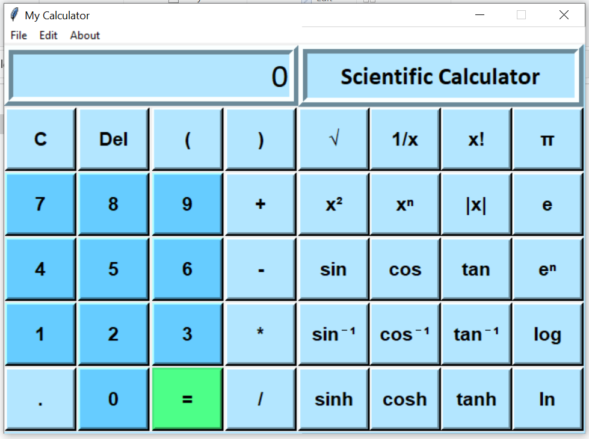

# Calculator
<pre>
Python Project using Tkinter

It is a calculator which has two modes
-> Standard mode
-> Scientific mode
These modes can be changed from the File menu.

It has an edit menu with options of cut, copy and paste
and an about menu.

On entering an incorrect expression a pop-up window appears stating the same.
</pre>
 

